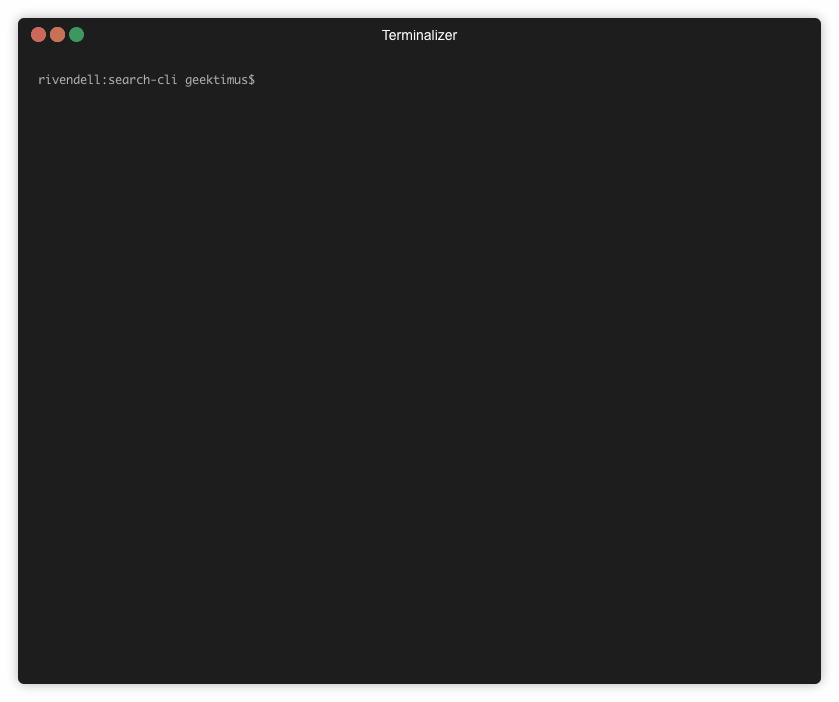

# Search CLI

[][semver]
[][travis_url]

This application allows the user to index a given folder and search for words in it using an inverted index that maps words to file names.

## Getting Started

These instructions will get you a copy of the app to be used on your local machine.

### Prerequisites

To build and run this small app you just need to have **Java 8** installed.

To check that you have Java installed just run this command:

```
javac -version
```

It should show something like: `javac 1.8.0_162`

### Installing

- Clone the repository

```
git clone https://github.com/geektimus/java-text-search-cli.git search-cli
cd ~/search-cli
```

## Usage

This application expects one parameter which is required.

### Parameter

- Directory Path: This defines the directory to be used as the source of the files to be indexed.

For this project we have two options to run it from the console

### Build the jar and run the tool (Recommended)

You need to perform two steps

1) Build the jar using the gradle wrapper

```
./gradlew jar
```

This command will generate a jar file named **"search-cli.jar"** inside `build/libs/` folder by default.

2) Run the jar from the default location

```
java -jar build/libs/search-cli.jar <path-to-folder>
```
This will show you a prompt so you can search for words in the files inside `<path-to-folder>` folder.

### Run the app directly using gradle run task

```
./gradlew run --args="<path-to-folder>"
```

**Note:** This method is not recommended because the gradle daemon prints a progress bar while we run commands so the prompt will a mess to read.

Something like this:

```
./gradlew run --args="./src/test/resources/fake-directory"

> Task :run
Loaded 118 words
search>
<=<====={file: ./src/test/resources/fake-directory/b-text-file.txt, rank: 100}
{file: ./src/test/resources/fake-directory/a-text-file.txt, rank: 100}
search> t amet
<=========----> 75% EXECUTING [13s]
> :run
```

## Running the tests

In case you want to run the tests it's as simple as running this command

```
./gradlew test
```

### Demo



## Built With

- [Gradle 5.2.1][gradle] - Build Tool
- [Java 8][java_jdk] - Language

## Future Work

- Try to improve the tool using Akka for file parsing and indexing.
- Add hot reload to allow the user to add new files without having to restart the app.
- Add stem logic to reduce the number of words to be processed/indexed as we consider words with the same root as the same word, i.e, run, runner, runners, running.

## Contributing

Please read [CONTRIBUTING.md][contributing] for details on our code of conduct, and the process for submitting pull requests to us.

## Versioning

We use [SemVer][semver] for versioning. For the versions available, see the [tags on this repository][project_tags].

## Authors

- **Alex Cano** - _Initial work_ - [Geektimus][profile]

See also the list of [contributors][project_contributors] who participated in this project.

## License

[][license]

This project is licensed under the MIT License - see the [LICENSE.md][license] file for details

[travis_url]: https://travis-ci.org/geektimus/java-text-search-cli
[gradle]: https://gradle.org/install/
[java_jdk]: https://www.oracle.com/technetwork/java/javase/downloads
[contributing]: CONTRIBUTING.md
[semver]: http://semver.org/
[project_tags]: https://github.com/geektimus/java-text-search-cli/tags
[profile]: https://github.com/Geektimus
[project_contributors]: https://github.com/geektimus/java-text-search-cli/graphs/contributors
[license]: LICENSE.md